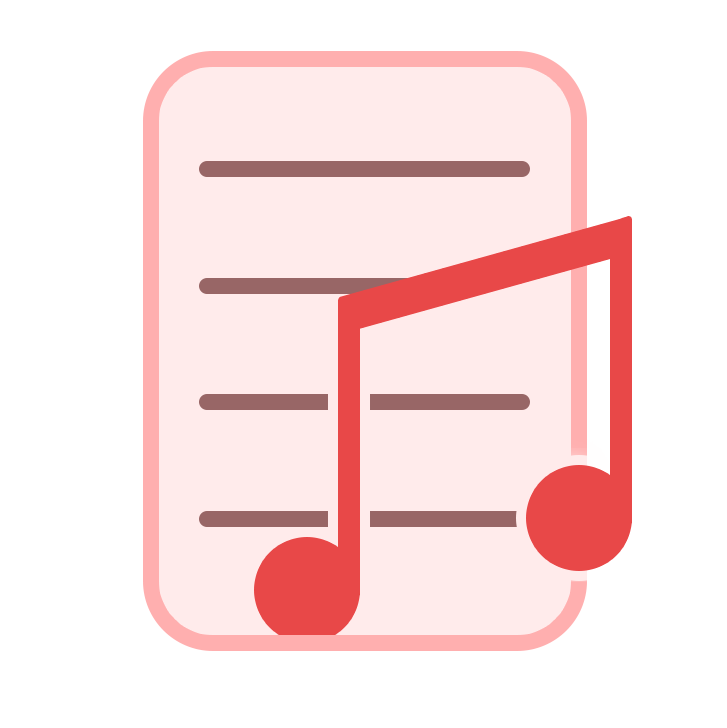

## MetaSet Program
**MetaSet** — is a simple tool, which can **change metadata** of sound files. 

### I don't understand English
🇷🇺 [**Русская** версия README.md](README.ru-RU.md).

### Which formats does MetaSet support?
MetaSet supports following formats: **.mp3, .flac, .ogg, .wav, .wma, .m4a, .aac, .aiff**.

### What're requirements?
MetaSet requires **.NET 6** for its work.

You can download **.NET 6** on Microsoft [official site](https://dotnet.microsoft.com/en-us/download/dotnet).
But, you need to download .NET **Desktop Runtime** or **SDK**, and not just **Runtime**, and its architecture should correspond to downloaded **MetaSet**.

If your computer is running Windows 10/11, then you can install use this command instead:
```bash
  winget install Microsoft.DotNet.DesktopRuntime.6
```

### Is it freeware or open source software?
MetaSet is an *open-source* program. It published under **GNU LGPL v3** licence.

### Does it use some 3rd-party libraries? If it uses, which does?
  - **[TagLibSharp](http://github.com/mono/taglib-sharp)**
  - **[.NET](http://github.com/dotnet/core)**
  - **[Windows Forms](http://github.com/dotnet/winforms)**
  
### Where can i download releases?
You can download releases [**there**](https://github.com/emildalalyan/MetaSet/releases).
  
