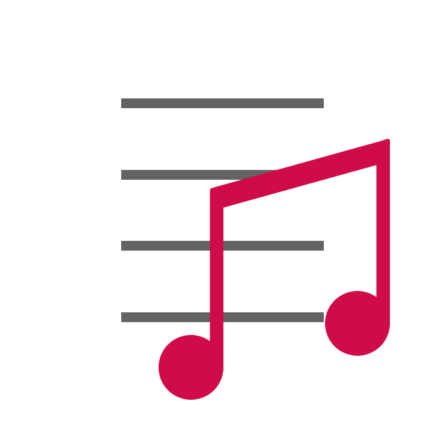

## Программа MetaSet
**MetaSet** — это простая утилита, которая позволяет *изменить метаданные*.

### Поддержка форматов
  MetaSet поддерживает следующие форматы: **.mp3, .flac, .ogg, .wav, .wma, .m4a**
 
### Это бесплатное или свободное программное обеспечение?
  MetaSet - это *open-source* программа, т.е является Свободным Программным Обеспечением. Программа выложена под лицензией **GNU LGPL v3**.

### Она использует 3ти-сторонние библиотеки?
  Да, она использует **[TagLibSharp](http://github.com/mono/taglib-sharp)**
  
### А где релизы?
[**Там**](https://github.com/emildalalyan/MetaSet/releases) распологаются релизы.
